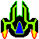

# portfolio
ポートフォリオページ

atomで追加

# 見出し1
## 見出し2
##### 見出し3

__太字 Bold__ _斜体 Italic_ ~~打消し線~~

`埋め込み` ```独立したコード```

```cs

  string a = "これはC#の初期のブロック";

```
### リンク

[unityroom](https://unityroom.com/)

[cluster](https://cluster.mu/)

### 画像一覧





### リスト

- Fire
- Water
- Wind

### 通しのリスト

1. マリオ
2. ルイージ
3. ピーチ

### 字下げアリのリスト

1. 生物
   - 哺乳類
     - 人間

### タスク

- [x] daily Genshin
- [x] daily fate
- [ ] daily honkai3rd

### 脚注

orange[^1]

apple[^2]

pomegranate[^3]

[^1]:みかん
[^2]:リンゴ
[^3]:ザクロ
