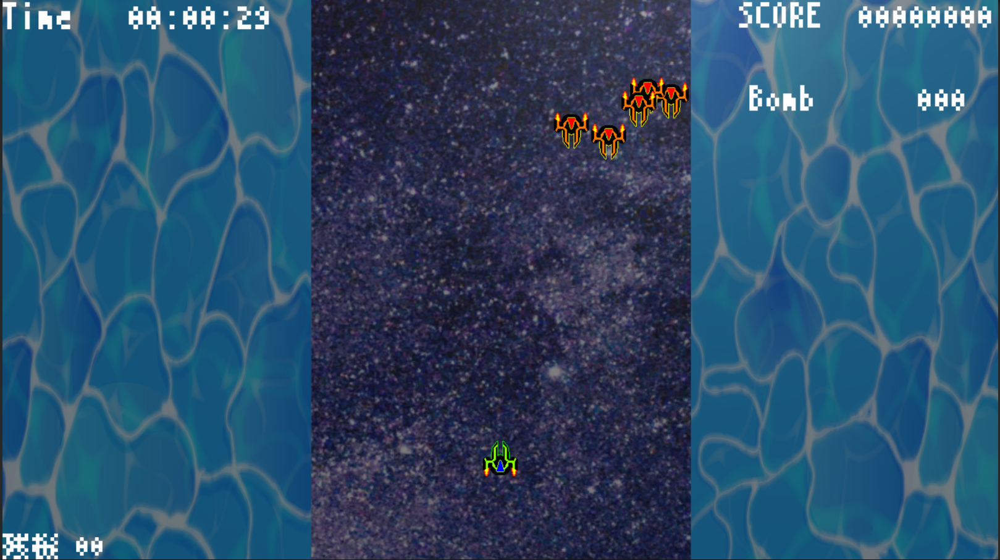
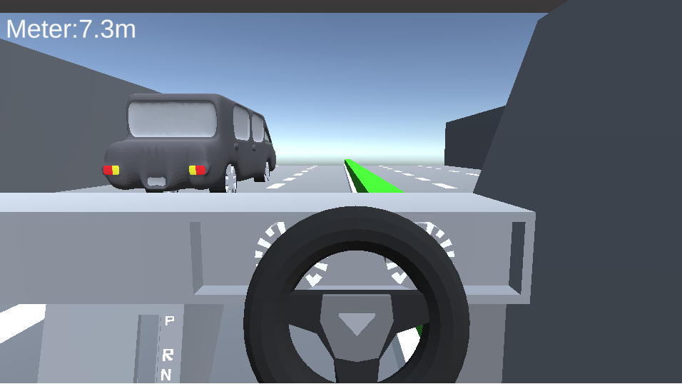

# Portfolio

- 江森　樹
- 連絡先 Email [E05mush0128@outlook.jp](mailto:E05mush0128@outlook.jp)
- 専門学校デジタルアーツ東京 ゲームプログラムコース 2023年卒業予定

## 資格

第二種電気工事士

## スキル
- C#
  - 利用歴: 1年
  - unity関連の簡単なプログラムのみ製作可能
- Unity
  - 利用歴: 1年
  - オリジナルの個人/チームでの製作経験アリ
- C/C++
  - 利用歴: 4年
  - 簡単なアルゴリズムを持ったプログラムを製作可能
- Blender
  - 利用歴: 2年
  - 簡単な3Dモデルを製作可能
- Aviutl
  - 利用歴: 1年
  - 動画の編集、結合など

## 取り組んでいるテーマ
- プレイアブルキャラの色とステージの色によって床になる場所の変更をする企画

## 作品リスト

#### uniryroom

[E05mush](https://unityroom.com/settings/games)

### Barrage

Barrage

作品概要

- 開発環境：unity/チーム
- 開発期間：約1ヵ月
- 製作物　：2Dモデル

### 機械戦線

機械戦線

作品概要

- 開発環境：unity/チーム
- 開発期間：現在鋭意制作中
- 製作物　：3Dモデル, 敵AIのプログラム

### racegame

[racegame](https://unityroom.com/games/race_games)

作品概要

- 開発環境　　：unity/個人
- 使用アセット：なし
- 開発期間　　：約15日

## 連絡先
- E-mail [E05mush0128@outlook.jp](mailto:E05mush0128@outlook.jp)
