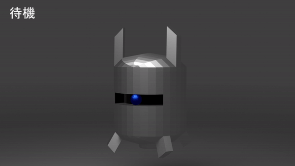

# Portfolio

- 江森　樹
- 連絡先 Email [E05mush0128@outlook.jp](mailto:E05mush0128@outlook.jp)
- 専門学校デジタルアーツ東京 ゲームプログラムコース 2023年卒業予定

## 資格

第二種電気工事士

## スキル
- C#
  - 利用歴: 1年
  - unity関連の簡単なプログラムのみ製作可能
- Unity
  - 利用歴: 1年
  - オリジナルの個人/チームでの製作経験アリ
- C/C++
  - 利用歴: 4年
  - 簡単なアルゴリズムを持ったプログラムを製作可能
- Blender
  - 利用歴: 2年
  - 動きのある3Dモデルを製作可能
- Aviutl
  - 利用歴: 1年
  - 動画の編集、結合など

## 取り組んでいるテーマ
- プレイアブルキャラの色とステージの色によって床になる場所の変更をする企画
- 一人称脱出ゲームの試作型

## 作品リスト

#### uniryroom

[E05mush](https://unityroom.com/settings/games)

### Barrage

Barrage

作品概要

- 開発環境：unity/チーム
- 開発期間：約1ヵ月
- 製作物　：2Dモデル

#### 制作物

### racegame

[racegame](https://unityroom.com/games/race_games)

作品概要

- 開発環境　　：unity/個人
- 開発期間　　：約15日
- 使用アセット：なし

### 機械戦線

機械戦線

作品概要

- 開発環境：unity/チーム
- 開発期間：現在鋭意制作中
- 製作物　：3Dモデル, 敵AIのプログラム

#### 制作物
3Dモデル

3Dモデルのアニメーション

プログラム
Robotの移動

    using System.Collections;
    using System.Collections.Generic;
    using UnityEngine;
    using UnityEngine.AI;
    
    [RequireComponent(typeof(NavMeshAgent))]
    
    
    
    public class Robot_Move : MonoBehaviour
    {

      [SerializeField]
      [Tooltip("追いかける対象")]
      public GameObject player;

      public NavMeshAgent navMeshAgent;
      public Rigidbody rb;
      public AudioClip footSound;

      Animator animator;

      private AudioSource audioSource;

      // Start is called before the first frame update
      void Start()
      {
          navMeshAgent = GetComponent<NavMeshAgent>();
          rb = GetComponent<Rigidbody>();
          audioSource = GetComponent<AudioSource>();
      }

      // Update is called once per frame
      void Update()
      {
          animator = GetComponent<Animator>();
          
          navMeshAgent.destination = player.transform.position;
          animator.SetTrigger("FootSound");
      }
    
      //プレイヤーとの衝突時の反発を無くす
      private void OnCollisionStay(Collision boxCollision)
      {
          if (boxCollision.collider.gameObject.tag == "Player" || boxCollision.collider.gameObject.tag == "Enemy")
          {
              rb.velocity = Vector3.zero;
              rb.angularVelocity = Vector3.zero;
          }
      }
      
      //足音を鳴らす
      public void PlayFootSound()
      {
          audioSource.PlayOneShot(footSound);
      }
    }
    
Robotに攻撃をさせる

    using System.Collections;
    using System.Collections.Generic;
    using UnityEngine;

    public class Robot_Raycast : MonoBehaviour
    {
        [SerializeField] GameObject robotForward; // ロボットの前面
        [SerializeField] float distance = 10f;    // 検出可能な距離
        [SerializeField] GameObject eyesLine;     // RayCastのスタート時点

        // Start is called before the first frame update
        void Start() { }

        // Update is called once per frame
        void Update()
        {
            Animator animator = GetComponent<Animator>();

            // Rayはロボットの前面からとばす
            var rayDirection = robotForward.transform.forward.normalized;

            // Hitしたオブジェクト格納用
            RaycastHit raycastHit;

            var isHit = Physics.Raycast(eyesLine.transform.position, rayDirection, out raycastHit, distance);

            Debug.DrawRay(eyesLine.transform.position, rayDirection * distance, Color.blue);

            if (isHit)
            {
                //Debug.Log("HitObject : " + raycastHit.collider.gameObject.name);
                if (raycastHit.collider.gameObject.tag == "Player")
                {
                    animator.SetBool("HitPlayer", true);
                    //TinyAudio.PlaySE(TinyAudio.SE.enemyAttack1);
                }
            }
            else
            {
                animator.SetBool("HitPlayer", false);
            }
        }
    }

アニメーションをランダムに再生させる

    using System.Collections;
    using System.Collections.Generic;
    using UnityEngine;

    public class RandamAnim : MonoBehaviour
    {

        int rand;

        // Start is called before the first frame update
        void Start()
        {

        }

        // Update is called once per frame
        void Update()
        {
            Animator animator = GetComponent<Animator>();
            rand = Random.Range(0, 3);

            animator.SetInteger("Random", rand);
        }
    }

### 個人製作

## 連絡先
- E-mail [E05mush0128@outlook.jp](mailto:E05mush0128@outlook.jp)
